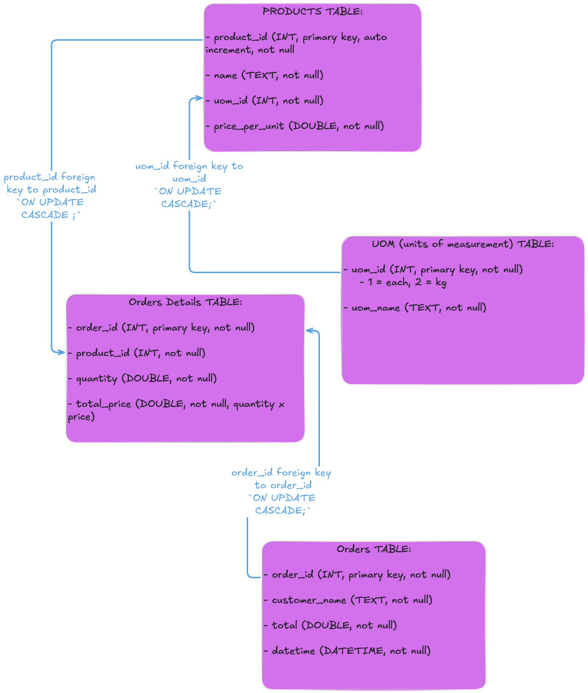

# Fullstack Grocery Store POS

- [Fullstack Grocery Store POS](#fullstack-grocery-store-pos)
- [Database Design](#database-design)

A ready to use full stack grocery store web application I made from scratch. Uses HTML/CSS/Bootstrap as the frontend, Python as the backend, and sqlite for the database.

# Database Design

