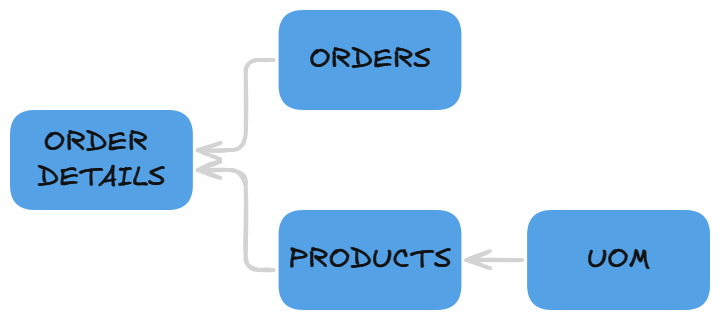
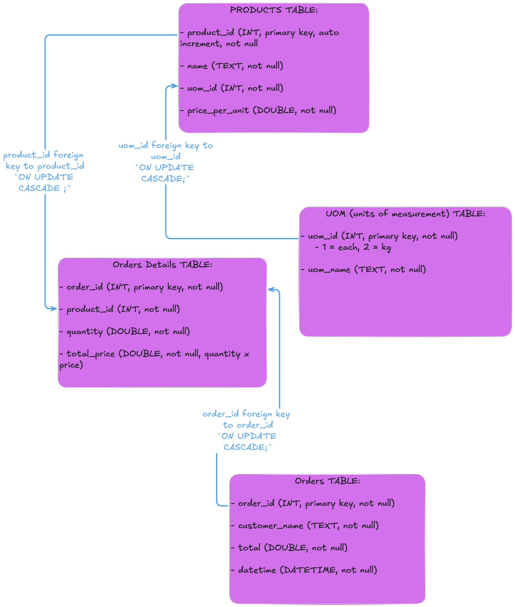
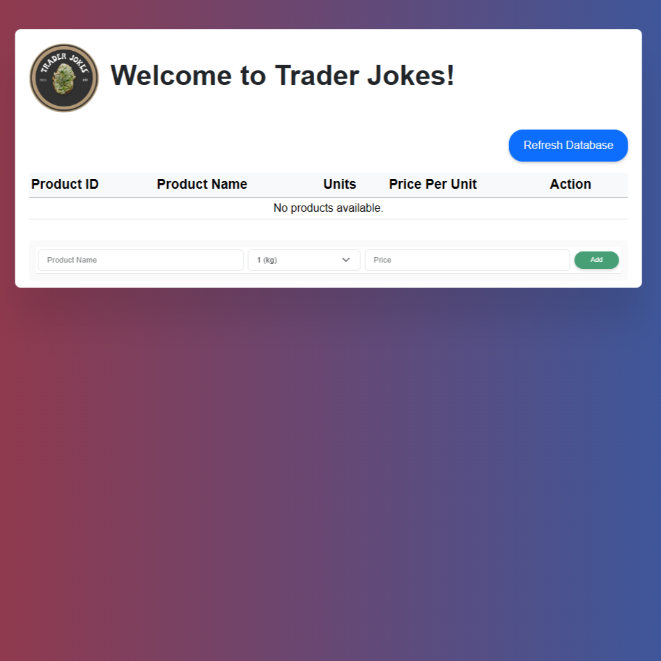
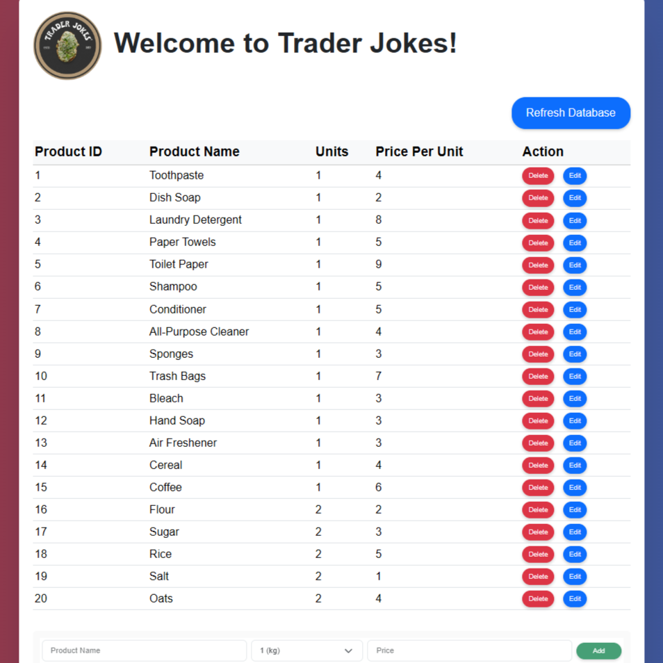
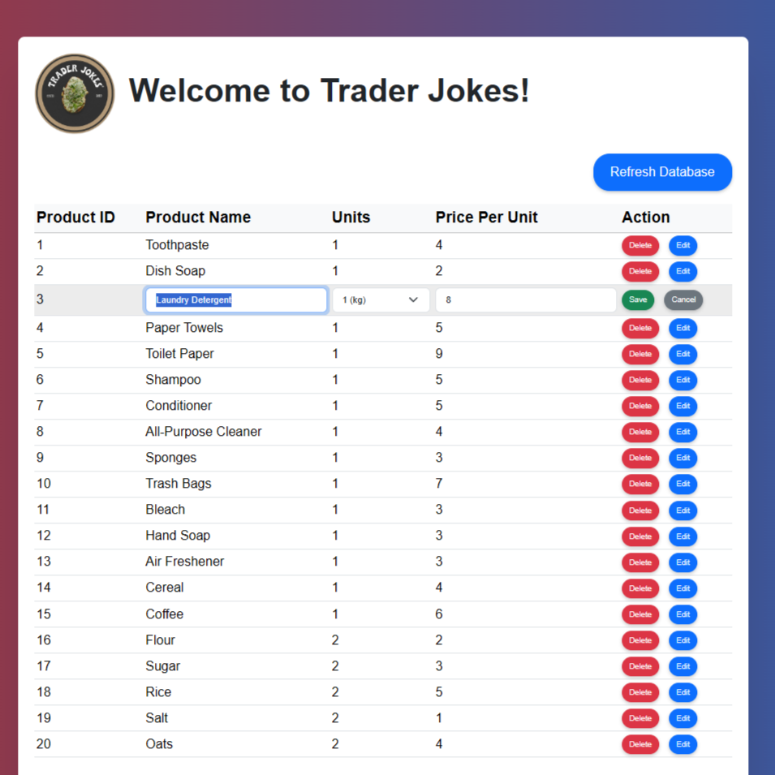
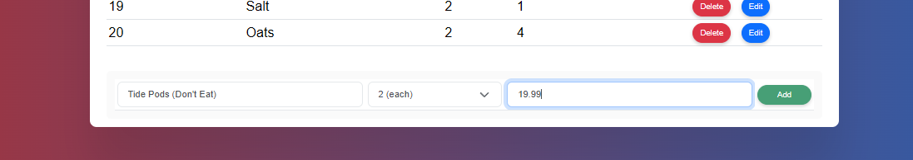

# Fullstack Grocery Store POS

- [Fullstack Grocery Store POS](#fullstack-grocery-store-pos)
- [Database Design](#database-design)
- [UI](#ui)
    - [No Products View:](#no-products-view)
    - [Products List View:](#products-list-view)
    - [Edit Product View:](#edit-product-view)
    - [Add Product View:](#add-product-view)

A ready to use full stack grocery store web application I made from scratch. Uses HTML/CSS/Bootstrap as the frontend, Python as the backend, and sqlite for the database.

# Database Design
The database is using SQLite and also SQLite3 library in python. For viewing, managing, and editing the database it was mostly done within the free VSCode extension SQLite3 Editor. I highly HIGHLY recommend this extension. Link 👇🏽  
https://marketplace.visualstudio.com/items?itemName=yy0931.vscode-sqlite3-editor

For reference, to see the SQL queries that i used throughout the project you can check out app > db > schema.sql and app > db > queries.py. The later is a py file made purely for readability in the ORM (products_dao).

Here is a simple overview on the data flow:

Here is a more detailed explanation on the columns each table has as well as the references:

# UI

The UI is made with simple html and bootstrap css. The interactivity of the table view is js, so i.e. the on pageload refresh the database and populate table. The buttons route into server.py which then uses my simple ORM (products_dao) on the backend to manipulate the database.

Here is what the UI looks like:
### No Products View:

### Products List View:

### Edit Product View:

### Add Product View:
